<p align="center">
  
</p>

<p align="center">
  
</p>

<p align="center">
  <a href="mailto:zeshanahmedoff@gmail.com"></a>
  <a href="https://www.linkedin.com/in/expert-fullstack-webdeveloper/"></a>
  <a href="https://drive.google.com/file/d/your-resume-id/view"></a>
  
</p>

---

## 🌌 About Me

```yaml
name: Zeeshan Ahmed Sarwar
role: Senior Software Engineer
location: Remote | UK Ltd Registered
specialities:
  - React.js | Next.js | TypeScript
  - Ruby on Rails | Hotwire | Stimulus
  - Node.js | Fastify | GraphQL
  - AWS | PostgreSQL | Docker | Microservices
interests:
  - AI-driven engineering
  - Futuristic system design
  - Building scalable startups
```

---

## 🕰 Career Timeline

```mermaid
timeline
    title 🚀 My Tech Journey
    2019 : Devsinc : Associate Software Engineer
    2020 : Exponento : Frontend Developer (WordPress / Node / PHP)
    2021 : SplitSpot : Full Stack Engineer (Rails + React)
    2022 : CFP Energy (UK) : Founding Engineer | React → Next.js Migration | Real-time dashboards
    2023 : CurveHealth : Rails + Medplum + React for healthcare
    2024 : Maximus : Telehealth platform | Appointment sync + EMR
    2024-Present : UNTIL + DitchCarbon : AI, Serverless, and Climate-tech
```



---

## ⚡ Tech Stack

<p align="center">
  <!-- Frontend -->
  
  
  
  <!-- Backend -->
  
  
  
  <!-- Cloud & DB -->
  
  
  
</p>

---

## 💼 Featured Projects

| Project             | Description                                 | Tech                      | Screenshot                                                              |
| ------------------- | ------------------------------------------- | ------------------------- | ----------------------------------------------------------------------- |
| [⚡ Hiro Flash](#)  | AI-powered PnL reports + Trading dashboards | React, Next.js, Rails, AI |   |
| [🠠SplitSpot](#)   | Automated rental workflows (Rails + React)  | Rails, React, PostgreSQL  |    |
| [❤️ CurveHealth](#) | Healthcare EMR with Medplum + Rails         | Rails, React, Medplum     |  |
| [🌠DitchCarbon](#) | Climate AI prediction dashboards            | Fastify, React, AI        |  |

---

## 🎯 Currently Working On

```yaml
projects:
  - name: 'DitchCarbon AI Platform'
    status: '🚀 In Development'
    tech: ['Node.js', 'React', 'AI/ML', 'Climate Data']
  - name: 'Healthcare EMR Integration'
    status: '🔧 Optimizing'
    tech: ['Rails', 'Medplum', 'FHIR', 'PostgreSQL']
focus_areas:
  - AI-driven climate prediction models
  - Microservices architecture optimization
  - Real-time data processing pipelines
```

---

## 📈 GitHub Stats

<p align="center">
  
  
</p>

<p align="center">
  
  
</p>

---

<p align="center">
  
</p>
