<p align="center">
  
</p>

<p align="center">
  
</p>

<p align="center">
  <a href="mailto:zeshanahmedoff@gmail.com"></a>
  <a href="https://www.linkedin.com/in/expert-fullstack-webdeveloper/"></a>
  <a href="https://drive.google.com/file/d/your-resume-id/view"></a>
  
</p>

---

## 🌌 About Me

```yaml
name: Zeeshan Ahmed Sarwar
role: Senior AI Software Engineer
location: Remote | UK Ltd Registered | Open for Contract Work
specialities:
  - React.js | Next.js | TypeScript
  - Ruby on Rails | PostgreSQL
  - Node.js | Fastify | GraphQL | Nest js
  - Python | AI Integration | LLM | GenAI
  - AWS | Docker | Microservices
interests:
  - AI-driven engineering
  - Futuristic system design
  - Building scalable startups
```

---

## 🕰 Career Timeline

```mermaid
timeline
    title 🚀 My Tech Journey
    2019 : Devsinc : Associate Software Engineer
    2020 : Devsinc : Promoted to Software Engineer
    Aug 2020 - Nov 2021 : Prontoetech Services : Full Stack Engineer
    Nov 2021 - Nov 2022 : Splitpost : Full Stack Software Engineer
    Nov 2022 - Present : CFP Energy : Senior AI Software Engineer
```



---

## ⚡ Tech Stack

<p align="center">
  <svg width="400" height="40" xmlns="http://www.w3.org/2000/svg">
    <defs>
      <linearGradient id="gradient1" x1="0%" y1="0%" x2="100%" y2="0%">
        <stop offset="0%" stop-color="#00f5ff" />
        <stop offset="100%" stop-color="#ff00ff" />
      </linearGradient>
    </defs>
    <text x="50%" y="25" text-anchor="middle" font-family="Orbitron, monospace" font-size="16" font-weight="600" fill="url(#gradient1)">
      ────────── FRONTEND ──────────
    </text>
  </svg>
</p>

<div style="display: flex; flex-wrap: wrap; gap: 8px; justify-content: flex-start;">


</div>

<p align="center">
  <svg width="400" height="40" xmlns="http://www.w3.org/2000/svg">
    <defs>
      <linearGradient id="gradient2" x1="0%" y1="0%" x2="100%" y2="0%">
        <stop offset="0%" stop-color="#00f5ff" />
        <stop offset="100%" stop-color="#ff00ff" />
      </linearGradient>
    </defs>
    <text x="50%" y="25" text-anchor="middle" font-family="Orbitron, monospace" font-size="16" font-weight="600" fill="url(#gradient2)">
      ────────── BACKEND & APIs ──────────
    </text>
  </svg>
</p>

<div style="display: flex; flex-wrap: wrap; gap: 8px; justify-content: flex-start;">


</div>

<p align="center">
  <svg width="450" height="40" xmlns="http://www.w3.org/2000/svg">
    <defs>
      <linearGradient id="gradient3" x1="0%" y1="0%" x2="100%" y2="0%">
        <stop offset="0%" stop-color="#00f5ff" />
        <stop offset="100%" stop-color="#ff00ff" />
      </linearGradient>
    </defs>
    <text x="50%" y="25" text-anchor="middle" font-family="Orbitron, monospace" font-size="16" font-weight="600" fill="url(#gradient3)">
      ──────── AI & MACHINE LEARNING ────────
    </text>
  </svg>
</p>

<div style="display: flex; flex-wrap: wrap; gap: 8px; justify-content: flex-start;">


</div>

<p align="center">
  <svg width="470" height="40" xmlns="http://www.w3.org/2000/svg">
    <defs>
      <linearGradient id="gradient4" x1="0%" y1="0%" x2="100%" y2="0%">
        <stop offset="0%" stop-color="#00f5ff" />
        <stop offset="100%" stop-color="#ff00ff" />
      </linearGradient>
    </defs>
    <text x="50%" y="25" text-anchor="middle" font-family="Orbitron, monospace" font-size="16" font-weight="600" fill="url(#gradient4)">
      ─────── CLOUD & INFRASTRUCTURE ───────
    </text>
  </svg>
</p>

<div style="display: flex; flex-wrap: wrap; gap: 8px; justify-content: flex-start;">


</div>

<p align="center">
  <svg width="440" height="40" xmlns="http://www.w3.org/2000/svg">
    <defs>
      <linearGradient id="gradient5" x1="0%" y1="0%" x2="100%" y2="0%">
        <stop offset="0%" stop-color="#00f5ff" />
        <stop offset="100%" stop-color="#ff00ff" />
      </linearGradient>
    </defs>
    <text x="50%" y="25" text-anchor="middle" font-family="Orbitron, monospace" font-size="16" font-weight="600" fill="url(#gradient5)">
      ──────── DATABASES & STORAGE ────────
    </text>
  </svg>
</p>

<div style="display: flex; flex-wrap: wrap; gap: 8px; justify-content: flex-start;">


</div>

<p align="center">
  <svg width="430" height="40" xmlns="http://www.w3.org/2000/svg">
    <defs>
      <linearGradient id="gradient6" x1="0%" y1="0%" x2="100%" y2="0%">
        <stop offset="0%" stop-color="#00f5ff" />
        <stop offset="100%" stop-color="#ff00ff" />
      </linearGradient>
    </defs>
    <text x="50%" y="25" text-anchor="middle" font-family="Orbitron, monospace" font-size="16" font-weight="600" fill="url(#gradient6)">
      ────────── TESTING & QUALITY ──────────
    </text>
  </svg>
</p>

<div style="display: flex; flex-wrap: wrap; gap: 8px; justify-content: flex-start;">


</div>

<p align="center">
  <svg width="400" height="40" xmlns="http://www.w3.org/2000/svg">
    <defs>
      <linearGradient id="gradient7" x1="0%" y1="0%" x2="100%" y2="0%">
        <stop offset="0%" stop-color="#00f5ff" />
        <stop offset="100%" stop-color="#ff00ff" />
      </linearGradient>
    </defs>
    <text x="50%" y="25" text-anchor="middle" font-family="Orbitron, monospace" font-size="16" font-weight="600" fill="url(#gradient7)">
      ────────── DEVOPS & CI/CD ──────────
    </text>
  </svg>
</p>

<div style="display: flex; flex-wrap: wrap; gap: 8px; justify-content: flex-start;">


</div>

<p align="center">
  <svg width="480" height="40" xmlns="http://www.w3.org/2000/svg">
    <defs>
      <linearGradient id="gradient8" x1="0%" y1="0%" x2="100%" y2="0%">
        <stop offset="0%" stop-color="#00f5ff" />
        <stop offset="100%" stop-color="#ff00ff" />
      </linearGradient>
    </defs>
    <text x="50%" y="25" text-anchor="middle" font-family="Orbitron, monospace" font-size="16" font-weight="600" fill="url(#gradient8)">
      ────── MONITORING & ANALYTICS ──────
    </text>
  </svg>
</p>

<div style="display: flex; flex-wrap: wrap; gap: 8px; justify-content: flex-start;">


</div>

<p align="center">
  <svg width="420" height="40" xmlns="http://www.w3.org/2000/svg">
    <defs>
      <linearGradient id="gradient9" x1="0%" y1="0%" x2="100%" y2="0%">
        <stop offset="0%" stop-color="#00f5ff" />
        <stop offset="100%" stop-color="#ff00ff" />
      </linearGradient>
    </defs>
    <text x="50%" y="25" text-anchor="middle" font-family="Orbitron, monospace" font-size="16" font-weight="600" fill="url(#gradient9)">
      ───────── DEVELOPER TOOLS ─────────
    </text>
  </svg>
</p>

<div style="display: flex; flex-wrap: wrap; gap: 8px; justify-content: flex-start;">


</div>

---

## 💼 Featured Projects

<div align="center">

### 🚀 Project Showcase

</div>

<table style="border-collapse: separate; border-spacing: 20px;">
<tr>
<td width="45%" valign="top" style="border: 2px solid #e1e8ed; border-radius: 15px; padding: 20px; background: #fafbfc;">

<!-- Screenshot -->
<div align="center" style="height: 120px; border-radius: 10px; margin-bottom: 15px; overflow: hidden;">

</div>

<div align="center">

**⚡ Hiro Flash**
<br/>
_AI-powered PnL reports + Trading dashboards_

[](#)


```yaml
features:
  - Real-time trading analytics
  - AI-driven profit/loss insights
  - Interactive financial dashboards
```

</div>

</td>
<td width="45%" valign="top" style="border: 2px solid #e1e8ed; border-radius: 15px; padding: 20px; background: #fafbfc;">

<!-- Screenshot -->
<div align="center" style="height: 120px; border-radius: 10px; margin-bottom: 15px; overflow: hidden;">

</div>

<div align="center">

**🏠 SplitSpot**
<br/>
_Automated rental workflows (Rails + React)_

[](#)


```yaml
features:
  - Property management automation
  - Tenant workflow optimization
  - Real-time rental analytics
```

</div>

</td>
</tr>
<tr>
<td width="45%" valign="top" style="border: 2px solid #e1e8ed; border-radius: 15px; padding: 20px; background: #fafbfc;">

<!-- Screenshot -->
<div align="center" style="height: 120px; border-radius: 10px; margin-bottom: 15px; overflow: hidden;">

</div>

<div align="center">

**❤️ CurveHealth**
<br/>
_Healthcare EMR with Medplum + Rails_

[](#)


```yaml
features:
  - Electronic Medical Records
  - FHIR-compliant healthcare data
  - Patient management system
```

</div>

</td>
<td width="45%" valign="top" style="border: 2px solid #e1e8ed; border-radius: 15px; padding: 20px; background: #fafbfc;">

<!-- Screenshot -->
<div align="center" style="height: 120px; border-radius: 10px; margin-bottom: 15px; overflow: hidden;">

</div>

<div align="center">

**🌍 DitchCarbon**
<br/>
_Climate AI prediction dashboards_

[](#)


```yaml
features:
  - Climate data visualization
  - AI-powered predictions
  - Carbon footprint analytics
```

</div>

</td>
</tr>
</table>

<div align="center">

### 🎯 More Projects Coming Soon...

[](#)

</div>

---

## 🎯 Currently Working On

```yaml
projects:
  - name: 'DitchCarbon AI Platform'
    status: '🚀 In Development'
    tech: ['Node.js', 'React', 'AI/ML', 'Climate Data']
  - name: 'Healthcare EMR Integration'
    status: '🔧 Optimizing'
    tech: ['Rails', 'Medplum', 'FHIR', 'PostgreSQL']
focus_areas:
  - AI-driven climate prediction models
  - Microservices architecture optimization
  - Real-time data processing pipelines
```

---

## 📈 GitHub Stats

<p align="center">
  
  
</p>

<p align="center">
  
  
</p>

---

<p align="center">
  
</p>
